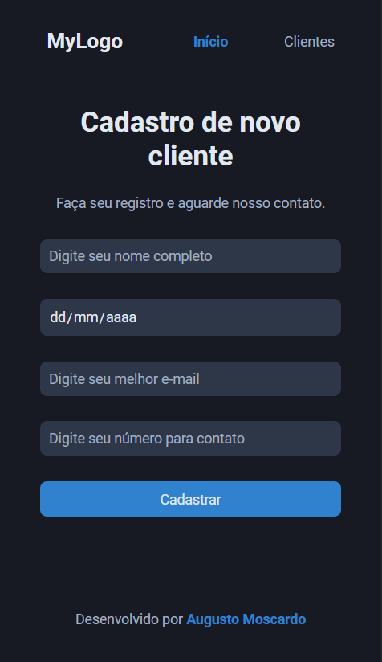
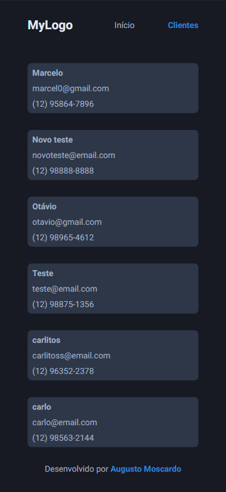

This is a [Next.js](https://nextjs.org/) project bootstrapped with [`create-next-app`](https://github.com/vercel/next.js/tree/canary/packages/create-next-app).

## Getting Started

First, install all depencies from package.json:
```bash
yarn
```

Then run the development server:
```bash
yarn dev
```

Make Sure to Setup Prisma:
```bash
generator client {
  provider = "prisma-client-js"
}

datasource db {
  provider = "sqlite"
  url      = env("DATABASE_URL")
}

model Cliente {
  id String @id @default(uuid())

  name      String
  birthday  String
  email     String
  telephone String


  @@map("clientes")
}
```

Execute 
```
yarn prisma migrate dev
```

Open [http://localhost:3000](http://localhost:3000) with your browser to see the result.

# Project view

  <div styles="display:flex; align-intems: center; jusity-content:space-between; width:100%">
    
    
    
  </div>
  <div "display:flex; align-intems: center; jusity-content:space-between; width:100%>
    
    
    
  </div>

  ## Technologies
Front:
- NextJS
- TypeScript
- ReactJS
- Phosphor-icons
- Formik
- Yup
- Styled-Components
- Axios

Back: 
- Node
- Express
- Cors
- Prismma ORM
- SQLite

## 🔗 Links
[](https://github.com/augustomoscardo)

[](https://www.linkedin.com/in/augustomoscardo)

## Badges

[](https://github.com/tterb/atomic-design-ui/blob/master/LICENSEs)
